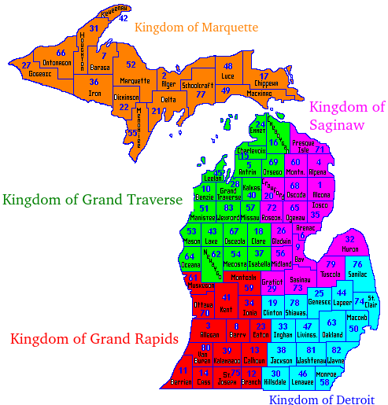

## Assumptions

1. Land can support 20 people per sq mi.
2. A mounted combatant (a "knight") requires 300 peoples' / 75 households worth of productive capacity to support.
3. Feudal retinues can be as large as ~two dozen (25) direct subordinates (barons to kings, knights to barons).
4. Maximum military mobilization during the fighting season is 5% (one male per per sqmi).
5. Urbanization rates of 5%. 4% in small towns, 1% in large towns.
6. Small towns have a population of approximately 2,000 people. Large towns have 4,000 people.

## Resultants

1. A knight requires 15 square miles to support himself, and can have a retinue of 15 men
2. A baron can muster up to 25 knights and 400 men, and he and his enfoeffed lords rule over 400 sqmi.
3. A king or earl rules over up to 25 barons, 650 knights, and can muster an army of 10,000 men. His kingdom is approximately 10,000 sqmi in size.
4. One small town is present for every 2,000 sqmi. It has a population of approximately 2,000 people and can field a militia of approximately 100 men.
5. One large town is present for every 10,000 sqmi. It has a population of approximately 4,000 and can field a militita of approximately 200 men. It is likely a free city pledged directly to the king.

## Michigan Townships & Counties

Michigan has 68 counties in the Lower Peninsula, and 15 counties in the UP.

A township in Michigan is a square 6 mi to a side (36 sqmi). It can thus support...

* 720 farmers
* 36 fighting men
* 2 knights

A county in Michigan is generally 24 mi to a size (16 townships or 576 sqmi). It can thus support...

* 11,520 people
* 576 fighting men
* 38 or so knights
* 1 or 2 barons

A king could rule over a substantial part of Michigan (12 to 25 counties). Likely...

* 3-4 king in the Lower Peninsula
* 1 king in the Upper Peninsula

## Michigan Kingdoms

| Kingdom                         | Type       | Number of each type | Population | Fighting Men | Knights | Barons |
|---------------------------------|------------|---------------------|------------|--------------|---------|--------|
| Kingdom of Detroit              | County     | 16                  | 188564     | 9429         | 629     | 22     |
|                                 | Large Town | 1                   | 4000       | 200          | 0       | 0      |
|                                 | Small Town | 3                   | 6000       | 300          | 0       | 0      |
| Kingdom of Detroit Total        |            | 20                  | 198564     | 9929         | 629     | 22     |
| Kingdom of Grand Rapids         | County     | 15                  | 173216     | 8662         | 576     | 19     |
|                                 | Large Town | 1                   | 4000       | 200          | 0       | 0      |
|                                 | Small Town | 3                   | 6000       | 300          | 0       | 0      |
| Kingdom of Grand Rapids Total   |            | 19                  | 183216     | 9162         | 576     | 19     |
| Kingdom of Grand Traverse       | County     | 20                  | 210154     | 10505        | 700     | 22     |
|                                 | Large Town | 1                   | 4000       | 200          | 0       | 0      |
|                                 | Small Town | 4                   | 8000       | 400          | 0       | 0      |
| Kingdom of Grand Traverse Total |            | 25                  | 222154     | 11105        | 700     | 22     |
| Kingdom of Marquette            | County     | 15                  | 324570     | 16229        | 1082    | 41     |
|                                 | Large Town | 2                   | 8000       | 400          | 0       | 0      |
|                                 | Small Town | 6                   | 12000      | 600          | 0       | 0      |
| Kingdom of Marquette Total      |            | 23                  | 344570     | 17229        | 1082    | 41     |
| Kingdom of Saginaw              | County     | 17                  | 198288     | 9917         | 661     | 22     |
|                                 | Large Town | 1                   | 4000       | 200          | 0       | 0      |
|                                 | Small Town | 3                   | 6000       | 300          | 0       | 0      |
| Kingdom of Saginaw Total        |            | 21                  | 208288     | 10417        | 661     | 22     |

### Kingdom of Grand Rapids

### Kingdom of Grand Traverse

### Kingdom of Detroit

### Kingdom of Saginaw

### Kingdom of Marquette

