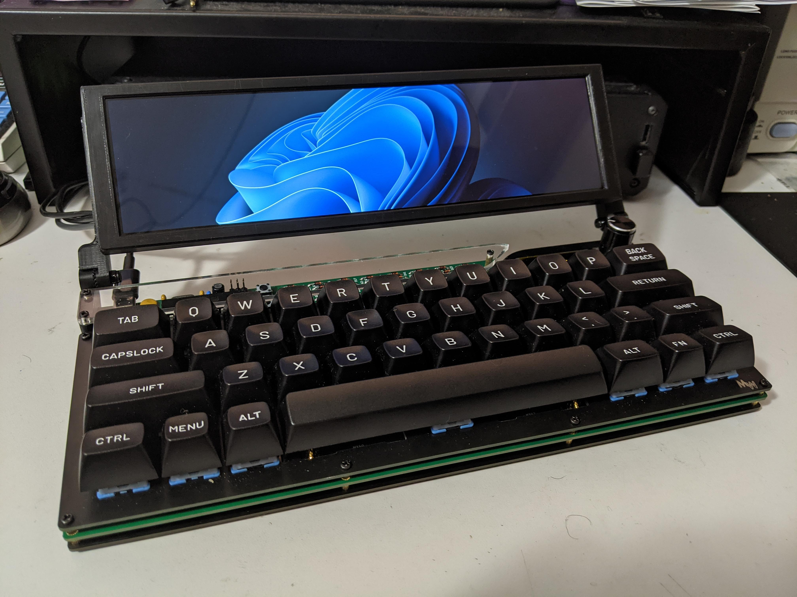

# Cyberdeck Project

## Inspirations

- [The Cyberdeck Cafe](https://cyberdeck.cafe/)
- [/r/cyberdeck](https://www.reddit.com/r/cyberdeck)
- [/r/cybergear](https://www.reddit.com/r/cybergear)

# Design Goals

## Mandatory

1. Full-size keyboard (since I'll mostly be interfacing with a terminal)
2. Raspberry Pi based (specifically the RPi 3 B that's sitting in my basement)
3. Linux (probably the stock Raspbian distro)
4. Battery pack with charger
5. Doesn't require a 3D printer for build

## Optional

1. Mechanical keyboard
2. Foldable
3. Aesthetically pleasing
4. Trackball

# Parts List

|Function	|Part					|Qty	|Price	|
|-----------|-----------------------|-------|-------|
|SBC		|Raspberry Pi Model 3	|1		|$0		|
|Display	|[Official Raspberry Pi 7" Display](https://www.pishop.us/product/official-raspberry-pi-7-touch-screen-display-with-10-finger-capacitive-touch/) |1 |$64.95 |
|Case		|[SmartiPi Touch Pro, Large - White](https://www.pishop.us/product/smartipi-touch-pro-large-white/) |1 |$27.95 |
|Keyboard	|[Qisan Magicforce 68 w/ Outemo Browns](https://www.amazon.com/dp/B01E8KO2B0) |1	|$39.98 |
|PSU		|[PowerBoost 1000 Charger - Rechargeable 5V Lipo USB Boost @ 1A - 1000C](https://www.pishop.us/product/powerboost-1000-charger-rechargeable-5v-lipo-usb-boost-1a-1000c/) |1 | $19.95 |
|Battery	|[Lithium Ion Battery Pack – 3.7V 6600mAh](https://www.pishop.us/product/lithium-ion-battery-pack-3-7v-6600mah/) |1	|$23.95|